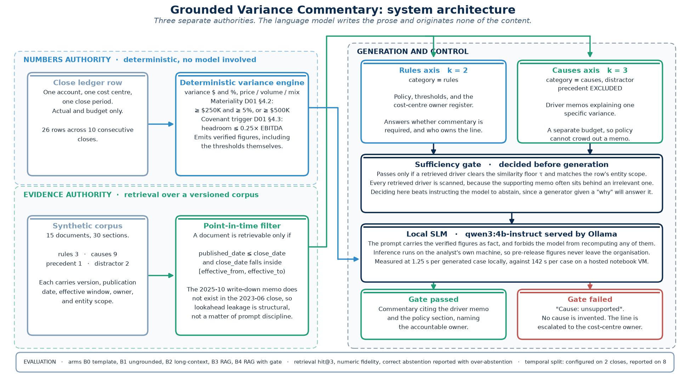
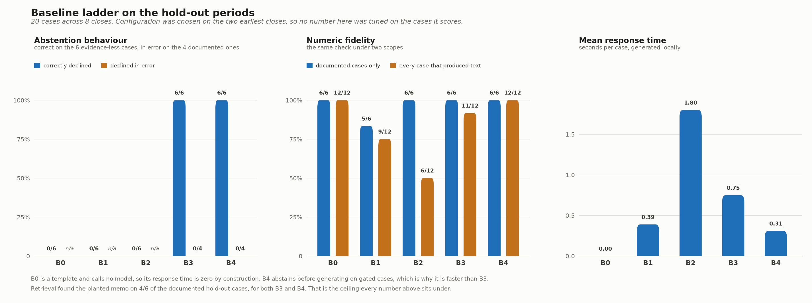
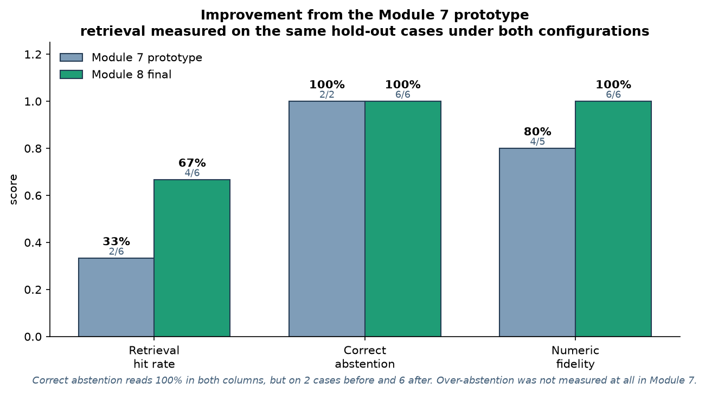

# Grounded Variance Commentary

**MAI 600 Natural Language Processing, Module 8 final project**
Lais Santos Silva, Atlantis University

A month-end FP&A assistant that drafts variance commentary from retrieved evidence, and
declines to state a cause when the evidence does not support one. Everything runs
locally through Ollama, so no financial figure leaves the machine.

> This system is a classroom prototype. Outputs should be reviewed by a human before
> real-world use.



---

## 1. Project overview

Every month-end close, an FP&A analyst has to explain why actual results diverged from
budget. A language model can write a fluent variance paragraph in seconds. However, a
paragraph that is fluent and wrong is worse than no paragraph, because a plausible cause
attached to a real dollar amount will be believed and then filed.

This project therefore separates three kinds of authority and lets the model hold only
the last one.

| Authority | Source | The model's role |
|---|---|---|
| Numbers | A deterministic variance engine in Python | Receives them as fact, and is forbidden to recompute any of them |
| Rules | Retrieved policy documents | Cites the section, and does not paraphrase the threshold |
| Causes | Retrieved driver memos | Cites the memo, or reports that no cause is supported |

The signature behavior is the third row. When retrieval finds no admissible memo, the
system does not guess. It writes "Cause: unsupported" and escalates to the named
cost-centre owner. Consequently, a retrieval failure degrades into returned work rather
than into a false explanation.

---

## 2. Problem statement

Three properties are required of month-end commentary, and a general-purpose chat model
satisfies none of them reliably.

1. **Numerical exactness.** A variance figure must match the ledger to the dollar. A
   model that recomputes or restates a figure introduces an error that no reader will
   catch, because the sentence around it reads correctly.
2. **Policy compliance.** Commentary is required on some lines and prohibited on others.
   The rule lives in a company policy document, and it changes between versions.
3. **Causal attribution to evidence.** The cause must come from a document that existed
   at the time of the close, covering the right entity, and not from the model's sense of
   what usually causes a cost increase.

In addition, the documents themselves are versioned and dated. A memo published after
the close cannot explain that close, although it will look highly relevant to any
similarity search that ignores dates.

---

## 3. Data description

Every document and every figure in this repository is synthetic. No real company's
policies, memos, or financial results appear anywhere in the project.

The corpus holds **15 documents across 30 retrievable sections**, written to mirror the
artefacts a mid-size manufacturer actually produces at close.

| Category | Retrieval axis | Documents | What it holds |
|---|---|---|---|
| `rules` | rules axis | 3 | Commentary policy, KPI definitions, the cost-centre owner register |
| `causes` | causes axis | 9 | Driver memos explaining one specific variance |
| `precedent` | excluded | 1 | A prior-period commentary pack |
| `distractor` | causes axis | 2 | Plausible memos about the wrong product line or the wrong period |

Each document carries a version, a publication date, an effective window, an owner, and
an entity scope. The point-in-time filter is built
entirely out of them, and the corpus deliberately contains a policy that exists in two
versions, memos published after the close they would explain, and near-duplicate memos
about the wrong scope.

Readable Markdown copies of all 15 documents are in
[`data/sample_documents/`](data/sample_documents/), generated from the machine-readable
[`data/corpus_documents.json`](data/corpus_documents.json).

**Evaluation cases.** [`data/test_cases.csv`](data/test_cases.csv) holds **26 variance
lines across 10 consecutive monthly closes**, in the mix a real close produces rather
than a set of unit-test probes.

| Stratum | Cases | What it tests |
|---|---|---|
| `immaterial` | 10 | That the system produces no commentary where policy prohibits it |
| `evidence_less` | 8 | That it abstains rather than inventing a cause |
| `documented` | 6 | That it retrieves the planted memo and cites it |
| `version_sensitive` | 1 | That it prefers the approved memo over the superseded proposal |
| `covenant` | 1 | That a non-dollar materiality rule fires |

### How a real company would use these documents

The synthetic corpus is a stand-in for four document sets that a finance organization
already maintains, usually without thinking of them as a corpus.

| Synthetic document | The real equivalent |
|---|---|
| D01 commentary policy, D03 KPI definitions | The close policy and the reporting manual, owned by Group FP&A |
| D04 cost-centre owner register | The existing ownership mapping in the ERP or the close checklist |
| D11 to D19 driver memos | Procurement, treasury, sales operations, and operations memos already circulated at close, today by email |
| D20 commentary pack | Last period's filed management commentary |

Therefore an implementation is not a data-collection project. It is a routing project:
the memos exist, and what is missing is the discipline of stamping each with a
publication date, an effective window, and an entity scope so that retrieval can be
restricted to what was knowable at the close. The engineering work that generalizes
across companies is the variance engine, the two-axis retrieval, and the abstention gate.
The corpus is per company, and so is the materiality policy encoded in the engine.

---

## 4. System architecture

Retrieval runs on **two axes over disjoint sub-corpora with separate top-k budgets**. A
single ranked list would let a strong policy match consume the whole budget and leave no
room for the memo that explains the variance, or the reverse.

A document is admissible for a given close only if

```
published_date <= close_date    and    close_date in [effective_from, effective_to)
```

This filter lives in the retrieval mask rather than in the prompt. Consequently no amount
of prompt drift can reintroduce lookahead leakage.

Abstention is decided **before** generation, by a sufficiency gate that passes only when
some retrieved driver clears the similarity floor and matches the row's entity scope. A
generator handed a "why" question will nearly always produce a why, so asking the model
to abstain would put the safety property in the least reliable part of the system.

- Embeddings: `sentence-transformers/all-MiniLM-L6-v2`
- Index: FAISS inner product over normalized vectors, so the score is cosine similarity
- Generation: `qwen3:4b-instruct` served locally by Ollama, temperature 0, seed 42
- Retrieval: `k_rules=2`, `k_causes=3`, `exclude_precedent=True`
- Sufficiency gate: `tau=0.25`, `require_scope_match=True`

The last two lines are the configuration every reported number was produced under, and
both the interface and `build/run_experiments.py` use it. The gate values matter and are
easy to get wrong: similarity scores on this corpus cluster between 0.34 and 0.45, so the
0.45 floor proposed in Module 7 makes the gate fire on every case.

---

## 5. Setup

Requires Python 3.12 and [Ollama](https://ollama.com).

```bash
python3 -m venv .venv && source .venv/bin/activate
pip install -r requirements.txt
ollama serve
ollama pull qwen3:4b-instruct
```

Tested on macOS 26.5 on Apple silicon, Python 3.12.10.

---

## 6. How to run

**The notebook**, which is the fastest way to see the whole system end to end:

```bash
jupyter lab notebooks/final_project_notebook.ipynb
```

**The Streamlit interface**:

```bash
streamlit run app/streamlit_app.py
```

Sign in with a name and a role. This is not authentication and the screen says so; the
name signs the commentary and the role selects the audience. A Reviewer additionally sees
the Method view.

The landing screen lists the ten evaluated closes, and it will also read a close from a
general-ledger CSV. A loaded close runs through the identical variance engine, retriever,
and gate, and is marked throughout as outside the evaluation set, because a ledger export
carries no ground truth and therefore cannot be scored.

Opening a close gives a workspace of three views, four for a Reviewer.

**Close review** is the working screen. Every line in the close appears with its account,
cost centre, actual, budget, and variance in dollars and percent, in accounting format, with
a triage status: below threshold, explanation found, chase the owner, or covenant alert.
Lines needing work sort to the top, and lines below the threshold are shown rather than
filtered, because a line that was reviewed and did not meet the threshold is a reportable
answer. Selecting a line opens the verified figures, the materiality decision in prose, the
retrieved evidence with its match strength, and the commentary.

**All periods** places the close in the context of the other nine.

**Results** is generated from `results/*.csv` and `images/*.png` at load, so the interface
cannot drift from the evaluation. It carries the headline scores, the replication table, the
retrieval comparison, the improvement over Module 7, both figures, and the full text of all
100 generated answers with the score each received.

**Method**, for Reviewers, holds the five comparison approaches, the similarity scores, the
planted-source marker, and the prompt inspector.

### The three stages are user-operated

| Stage | What it decides | Trigger | Model |
|---|---|---|---|
| 1. Reporting check | flagged or not flagged | automatic on opening a close | no |
| 2. Evidence search | is there a supporting memo | user action, one line or the whole close | no |
| 3. Commentary | the explanation, or a refusal | user action, one line or the whole close | yes |

Stages 1 and 2 are deterministic and free, so they do not need to be asked for. Stage 3 is
the only stage that calls the model, and it never runs on its own. Stage 2 never runs on a
line below the reporting threshold, which is the same gating the evaluation harness applies.

A refusal is drawn as a structurally different object from a drafted answer rather than the
same object in another colour, so that declining to answer cannot be mistaken for answering.
The interface still loads with Ollama stopped, and a close whose lines have no evidence
completes anyway, because refusing costs no model call.

**Reproduce every result file** (a few minutes, and it overwrites `results/`):

```bash
python tests/test_parity.py
python build/run_experiments.py
python build/make_improvement.py
```

**Regenerate the figures, the packaged data, and the notebook**:

```bash
python build/make_architecture.py
python build/package_repo.py
python build/make_notebook.py
```

---

## 7. Repository structure

```
README.md                                                   this file
ai_usage_disclosure.md                                      how AI tools were used
requirements.txt

notebooks/final_project_notebook.ipynb    runs top to bottom, outputs included

data/corpus_documents.json         the corpus, machine readable
data/sample_documents/             the same 15 documents as readable Markdown
data/test_cases.csv                26 cases across 10 closes, with the split labelled
data/training_examples.jsonl       LoRA examples from Module 7, retained for reference

src/app.py                         entry point for the Streamlit interface
src/rag_pipeline.py                corpus, retrieval, prompting, generation
src/evaluation.py                  metrics, harness, cases
src/utils.py                       the deterministic variance engine
src/gvc/                           the working package the four modules above re-export

app/streamlit_app.py               the interface

results/benchmark_results.csv      the B0 to B4 ladder, per-arm summary
results/evaluation_scores.csv      every case, every arm, fully scored
results/generated_outputs.csv      the raw text each arm produced
results/improvement_comparison.csv before and after against Module 7
results/retrieval_config_comparison.csv   three retrieval configurations, same cases
results/before_after_holdout.csv   arm B3 under both configurations
results/per_period_results.csv     month-over-month replication
results/parity_B3_module7_config.csv      the Colab-to-local parity check

images/system_architecture.png
images/evaluation_chart.png
images/improvement_chart.png

build/                             the scripts that generate everything above
tests/test_parity.py               gates all downstream work
```

The four modules `src/app.py`, `src/rag_pipeline.py`, `src/evaluation.py`, and
`src/utils.py` exist because the assignment prescribes those filenames. They re-export
from `src/gvc/`, which is the working package that `tests/test_parity.py` imports.


---

## 8. Evaluation

**The configuration was chosen on the two earliest closes and every reported number comes
from the eight later ones.** That temporal split is not a formality. An earlier candidate
configuration scored a perfect 4 out of 4 on the config periods and then abstained on
100% of the hold-out cases, because its absolute similarity threshold happened to sit just
above the score range of this corpus. Reporting on the cases used to configure would have
presented that failure as a success.

Five arms answer the question a reviewer should ask, which is whether the retrieval
machinery earns its complexity.

| Arm | What it is | What it isolates |
|---|---|---|
| B0 | Deterministic template, no model | Whether a language model is needed at all |
| B1 | Verified figures, no retrieval | What the model invents when unconstrained |
| B2 | Whole corpus in the prompt, unfiltered | Whether retrieval beats long context |
| B3 | Two-axis filtered retrieval | The proposed system |
| B4 | B3 plus the pre-generation gate and a numeric verifier | Whether the gate adds anything over B3 |

Four metrics are recorded. The last two are a pair and are never reported separately,
because a system that abstains on everything scores 100% on correct abstention alone.

1. **Retrieval hit@3**, whether the planted source appears in the causes axis
2. **Numeric fidelity**, whether every figure in the output traces to a verified figure or
   to retrieved text, reported at two scopes
3. **Correct abstention**, on cases where no supporting memo exists
4. **Over-abstention**, on cases where retrieval actually succeeded

Numeric fidelity is reported at two scopes because the narrow one is blind in an
important direction. Restricted to documented cases it answers "when the system states a
cause, are its figures sound". It cannot see a figure invented on a case that abstained,
since an abstaining case has no planted source and drops out of the measure entirely.

---

## 9. Results

Hold-out periods only: 20 cases across 8 consecutive closes.
Source: [`results/benchmark_results.csv`](results/benchmark_results.csv).

| Arm | Retrieval hit@3 | Numeric fidelity, documented | Numeric fidelity, all output | Correct abstention | Over-abstention | Mean seconds |
|---|---|---|---|---|---|---|
| B0 | n/a | 6/6 | 12/12 | 0/6 | n/a | 0.00 |
| B1 | n/a | 5/6 | 9/12 | 0/6 | n/a | 0.39 |
| B2 | n/a | 6/6 | 6/12 | 0/6 | n/a | 1.80 |
| **B3** | **4/6** | **6/6** | **11/12** | **6/6** | **0/4** | **0.75** |
| **B4** | **4/6** | **6/6** | **12/12** | **6/6** | **0/4** | **0.31** |



**B0 is the honest control.** A template gets every number
right, because no number ever came from the model. What it cannot do is state a cause,
which is the entire deliverable of month-end commentary.

**B1 shows the failure the project exists to prevent.** Given the same verified figures
and no evidence, the model supplies a fluent cause anyway, and on three cases it supplies
dollar amounts that appear in no source at all.

**B2 is the clearest argument in the study for retrieval over long context.** Scored only
on documented cases it looks perfect at 6 of 6. Scored on every case that produced text it
falls to 6 of 12, because with the whole corpus in the prompt the model repeatedly imports
the steel-index figures from the June 2023 memo into commentary about entirely different
accounts and periods. It is also the slowest arm. Therefore retrieval is not merely a
cheaper route to the same context, and the filtering is doing safety work that a larger
context window does not do.

**B4 beats B3 on the wide fidelity measure**, 12 of 12 against 11 of 12, and it is the
faster of the two because a gated case never reaches the model at all. The single B3 miss
is instructive: the model abstained correctly and then mentioned a dollar figure that
appears nowhere in its sources, which is exactly what B4's post-generation verifier
catches.

**Retrieval is the binding constraint**, at 4 of 6. The important observation is what
happens downstream of a miss. On both cases where the planted memo was not retrieved, the
output is not a wrong cause; it is an abstention. The failure mode degrades in the safe
direction, and for month-end reporting that is the difference between a usable system and
an unusable one.

### Month-over-month replication

Source: [`results/per_period_results.csv`](results/per_period_results.csv).

| Period | Cases | Retrieval | Correct abstention | Numeric fidelity |
|---|---|---|---|---|
| 2024-02 | 3 | 1/1 | 1/1 | 3/3 |
| 2024-05 | 3 | 1/1 | 1/1 | 3/3 |
| 2024-09 | 3 | n/a | 2/2 | 2/3 |
| 2024-12 | 2 | 1/1 | n/a | 2/2 |
| 2025-03 | 2 | 1/1 | n/a | 2/2 |
| 2025-06 | 2 | n/a | 1/1 | 2/2 |
| 2025-08 | 2 | 0/1 | n/a | 2/2 |
| 2025-10 | 3 | 0/1 | 1/1 | 3/3 |

Abstention holds across every close. Retrieval does not, and the two periods where it
fails are the ones whose supporting memo competes with a near-duplicate distractor. That
is a corpus-level property rather than a per-period accident, which is the useful thing to
learn from running the same system ten times instead of once.

---

## 10. Improvement from the Module 7 prototype

Every "before" value is read from the Module 7 result files and every "after" value from
the Module 8 result files. Nothing is transcribed by hand, because a hand-written table
slipped into a Module 7 draft once and missed a real failure.
Source: [`results/improvement_comparison.csv`](results/improvement_comparison.csv).

| Area | Module 7 prototype | Module 8 final |
|---|---|---|
| Retrieval hit rate, same hold-out cases | 2/6 (33%) | 4/6 (67%) |
| Numeric fidelity | 4/5, one case derived a threshold | 6/6 |
| Correct abstention | 2/2 | 6/6 |
| Over-abstention | not measured | 0/4 |
| Test cases | 8 hand-picked | 20 across 8 consecutive closes |
| Comparison arms | 1 (B3 only) | 5 (B0 to B4) |
| Validation design | none, configured and reported on the same cases | temporal split, configured on 2 closes and reported on 8 |
| Corpus | 12 documents | 15 documents |
| Materiality rules | dollar thresholds only | dollar thresholds plus the covenant trigger |
| Serving and speed | Colab VM, 142.19s per case | local Ollama, 1.25s per case |



Three of these deserve a note.

**The retrieval gain comes from a category correction, not a tuning pass.** The prior
commentary pack topped the causes axis in three of eight Module 7 cases and appeared in
six, because a commentary pack is lexically similar to every variance question ever asked.
It is not a driver memo, so excluding the `precedent` category from the causes axis would
have been correct without ever looking at the outcome. A `k=4` variant scores higher still
at 5 of 6, and it is reported in
[`results/retrieval_config_comparison.csv`](results/retrieval_config_comparison.csv) and
labelled as tuned, because its only justification was that it captured a gold document in
a case whose failure had already been inspected.

**Correct abstention reads 2/2 before and 6/6 after, which understates the change.** The
rate is 100% in both columns. However, the measurement went from two cases to eight, and
over-abstention was not measured at all in Module 7, which had hidden a candidate
configuration that abstained on everything.

**The speed change is a deployment result, not a benchmark.** Module 7 ran on a hosted
notebook VM at 142.19 seconds per generated case. Module 8 runs locally at 1.25 seconds.
Therefore the premise that pre-release financial figures must not leave the organization
stops being an argument and becomes something the repository demonstrates.

---

## 11. Limitations and responsible use

**This system is a classroom prototype. Outputs should be reviewed by a human before
real-world use.**

- **The corpus is synthetic and small.** Fifteen documents is enough to make retrieval
  fail in instructive ways, and far too few to estimate how it behaves against a real
  document store of thousands.
- **Retrieval is the binding constraint.** Two thirds of the planted sources are
  retrieved. Every miss becomes an abstention rather than a wrong answer, which is the
  safe direction, although an abstention is still work returned to the analyst.
- **One model, one embedding model, one seed.** No claim is made that the result
  generalizes to other local models.
- **The ground truth.** A retrieval hit means the intended
  document was found, not that a finance reviewer would agree it was the best available
  evidence.
- **Sample sizes are small.** Six documented cases and eight evidence-less cases support
  a direction, not a confidence interval.
- **Human review is required by design, not as a disclaimer.** The intended use is a first
  draft attached to its evidence, reviewed by the cost-centre owner the output names.
  Nothing produced here should be filed without that review.

**Privacy.** Inference runs locally through Ollama and no financial figure leaves the
machine. That is a property of this deployment rather than of the model, and it would have
to be re-established under any other serving arrangement.

---

## 12. References and disclosure

The academic article is submitted separately and is deliberately not held in this
repository. The primary sources behind the design are Lewis et al. (2020) on retrieval-augmented generation, Gao et al.
(2023) on the RAG design space, Ji et al. (2023) on hallucination in generation,
Rajpurkar et al. (2018) on answerability and the value of declining to answer, Rashkin et
al. (2023) on attribution to identified sources, Es et al. (2024) on reference-free RAG
evaluation, and Li et al. (2024) on long context against retrieval.

AI tool usage is disclosed in [`ai_usage_disclosure.md`](ai_usage_disclosure.md).
